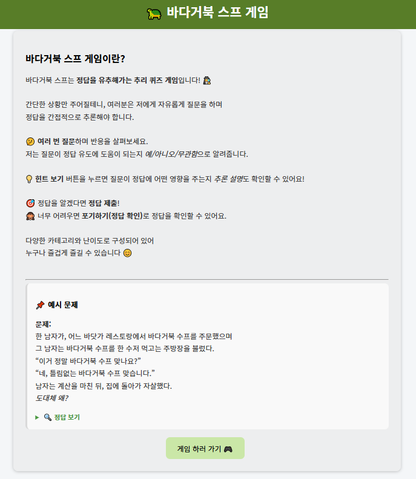

# 🐢 바다거북스프 게임 - Turtle Soup Reasoning Game

> "AI와 함께 추리하는 바다거북스프 게임 사이트"

**바다거북스프 게임**은 나폴리탄 괴담 계열의 수수께끼로, 전 세계적으로 사랑받는 추리게임입니다.  
하지만 이 게임은 보통 사람 간의 질의응답으로만 진행되어야 하며, 혼자서는 즐기기 어렵다는 한계가 있었습니다.

그래서 저는 이 게임을 **AI와 함께 즐길 수 있는 웹 기반 추리게임 플랫폼**으로 변형해보고자 했습니다.  
언제 어디서든, 누구나 혼자서도 추리의 즐거움을 경험할 수 있도록 말이죠.

이 플랫폼에서는:
- 다양한 **카테고리와 난이도의 문제**를 선택하고,
- AI에게 질문을 던져 **단서를 수집하고**,  
- 필요할 때는 **힌트를 받아 reasoning까지 확인**하며,  
- 최종적으로 **정답을 도출해내는 과정 전체를 스스로 체험**할 수 있습니다.

AI의 예/아니오 응답만으로는 부족하다고 느낄 때, **'힌트 보기' 기능**을 통해  
질문이 얼마나 정답에 가까워졌는지를 reasoning 방식으로 설명받는 것도 이 플랫폼만의 특별한 기능입니다.

**문제 선택 → AI 질의응답 → reasoning → 정답 제출 → 포기하기까지**  
단계별로 고도화된 추리 체험을 제공하는 이 플랫폼은, 단순한 게임 이상의 사고력 향상 도구가 될 수도 있습니다 😊

---

## 🎮 게임 설명

> “상황은 단순하지만, 정답은 복잡하다.”

- 바다거북 스프 게임은 **단편적인 상황에 대해 질문을 던지며 정답을 유추하는 추리 게임**입니다.
- AI에게 예/아니오 질문을 통해 단서를 얻고, 정답에 다가가는 방식입니다.
- 정답 유추가 어려울 땐 **힌트 보기**, **포기하고 답 보기**, **정답 제출하기** 기능도 제공합니다.




## 🧠 주요 기능

- ✅ 문제 리스트 조회 (카테고리 / 난이도 필터링)
- ✅ AI에게 질문 → 예/아니오/무관함 응답
- ✅ 질문 히스토리 자동 기록
- ✅ 질문에 대한 Reasoning 힌트 제공
- ✅ 정답 제출 & 정답 여부 확인
- ✅ 정답 포기 → 실제 답안 확인

## ⚙ 프로젝트 구성

| 항목 | 상세 |
|------|------|
| 프론트엔드 | HTML, CSS, JavaScript (Vanilla JS) |
| 백엔드 | FastAPI |
| DB | SQLite3 |
| 모델처리 | GPT-3.5 (OpenAI API 사용) / 추후 sLM 도입 가능 |
| 배포 | Docker + Docker Compose / Render 사용 예정 |
| 환경변수 | `.env`로 API Key 관리 (`OPENAI_API_KEY`) |

## 📁 디렉토리 구조

```
turtlesoup/
├── backend/
│   ├── app.py
│   ├── models/
│   │   ├── .env
│   │   └── model_handler.py
│   ├── db/
│   │   └── ai_turtle.db
│   └── Dockerfile
├── frontend/
│   ├── index.html
│   ├── js/
│   │   └── app.js
│   └── Dockerfile
├── docker-compose.yml
└── README.md
```

## 🚀 향후 확장 가능성

- 🔹 sLM fine-tuning 모델 도입
- 🔹 사용자 계정/랭킹 시스템
- 🔹 문제 업로드 / 커뮤니티 기능


## 💻 설치 및 실행 (로컬)

1. 프로젝트 클론
```bash
git clone https://github.com/yourname/turtlesoup.git
cd turtlesoup
```

2. 가상환경 설정 (선택)
```bash
conda create -n turtle python=3.10
conda activate turtle
```

3. Requirements 설치
```bash
pip install -r backend/requirements.txt
```

4. `.env` 파일 생성
```
OPENAI_API_KEY=sk-xxxxxx...
```

5. 실행
```bash
docker-compose up --build
```

6. 브라우저 접속
```
http://localhost:8080
```

## 🧑‍💻 제작자

- 기획/프론트/백엔드/모델 전부 손수 구현한 프로젝트입니다.
- contact: agnas5865@gmail.com
